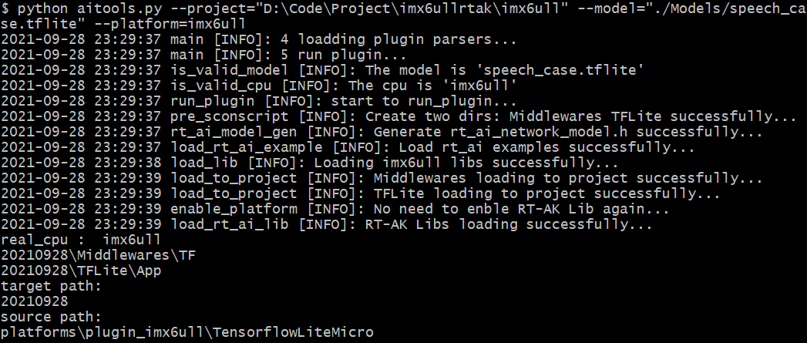

<center><h1>RT-AK 之 imx6ull</h1></center>

 [中文](./README.md)

- [简介](#简介)
- [目录结构](#目录结构)
- [命令行参数详细说明](#命令行参数详细说明)
- [插件安装](#插件安装)
- [命令行运行 RT-AK](#命令行运行-rt-ak)
- [插件内部工作流程](#插件内部工作流程)

## 简介

> Date: 2021/09/29
>
> ```shell
> # 模板
> python aitools.py --project <bsp> --model_name <model_name> --platform imx6ull
> 
> # 示例
> python aitools.py --project="D:\Code\Project\imx6ullrtak\imx6ull" --model="./Models/facelandmark.tflite" --platform=imx6ull

> ```
> 

> Date: 2021/09/29
>
> Update: 该版本插件尚未支持模型转化功能，使用的是转化好的头文件数组，后续将继续完成

*本项目归属于 `RT-AK` 主项目中的一个子模块。*

使用 `tensorflow lite micro` 作为插件推理后端。

- 模型支持：`TFLite`
- 算子支持：reference算子

该插件应用示例参考：

- 教程：docs/RT-AK之imx6ull快速上手.md

## 目录结构

```shell
% tree -L 2 imx6ull 
imx6ull
├── backend_plugin_imx6ull
│   ├── backend_imx6ull_tflite.c
│   ├── backend_imx6ull_tflite.h
│   └── readme.md
├── config.py  # 生成 `rt_ai_<model_name>_model.h` 的一些配置信息，保存在 <BSP>/applications
├── generate_rt_ai_model_h.py  # 生成 `rt_ai_<model_name>_model.h` ，保存在 <BSP>/applications
├── gen_rt_ai_model_c.py  # 生成 `rt_ai_<model_name>_model.c` ，保存在 <BSP>/applications
├── __init__.py
├── plugin_imx6ull_parser.py  # `imx6ull` 平台插件运行所需的参数
├── plugin_imx6ull.py  # `imx6ull` 平台插件运行主函数
├── prepare_work.py  # 生成两个文件夹，存放 TFLite库和 c-model 文件; 加载对应的 Sconscript
├── README.md
├── Sconscripts  # 模型转换之后，参与到项目 `scons` 编译的脚本文件
│   ├── Middlewares
│   └── TFLite
└── TensorflowLiteMicro  # `TFLite推理后端源码` 
```

## 命令行参数详细说明

$$
RT-AK 命令行的参数 = （RT-AK 基础参数 + imx6ull 插件参数）
$$

- RT-AK 基础参数，[链接](https://github.com/RT-Thread/RT-AK/tree/main/RT-AK/rt_ai_tools#0x03-%E5%8F%82%E6%95%B0%E8%AF%B4%E6%98%8E)

- 该部分是 RT-AK 之 STM32 插件的参数说明，详见 `plugin_imx6ull_parser.py` 

其中需要注意的是加粗部分的三个参数，请注意看相关描述。


| Parameter           | Description                                                  |
| ------------------- | ------------------------------------------------------------ |
| `--tflite`         | 运行所需的推理后端，默认为`./platforms/plugin_imx6ull/TensorflowLiteMicro` |
| `--stm_out`         | 产生的中间文件夹路径，默认是当天的时间戳命名 |    
| **--enable_rt_lib** | **在 `project/rtconfgi.h` 中打开宏定义，默认是 `RT_AI_USE_imx6ull`** |
| --clear              | 是否需要删除生成的中间文件夹 `stm_out` ，默认为`False` |

## 插件安装

该插件无需主动安装，

只需要克隆主项目工程：[RT-AK](https://github.com/RT-Thread/RT-AK)

进入到 `RT-AK/rt_ai_tools` 路径下，

**仅需要**在执行 `python aitools.py --xxx` 的同时指定 `platform` 参数为 `imx6ull` 即可，插件会自动下载。

## 命令行运行 RT-AK

请在 `xxx/RTAK/tools` 路径下运行该程序。


```shell
# 基础运行命令
python aitools.py --project <bsp> --model_name <model_name> --platform imx6ull

# 示例
python aitools.py --project="D:\Code\Project\imx6ullrtak\imx6ull" --model="./Models/speech_case.tflite" --platform=imx6ull --clear
```




完整的项目实战例程，请阅读：[RT-AK之imx6ull快速上手.md](./docs/RT-AK之STM32快速上手.md)

## 插件内部工作流程

- [ ] 模型量化

- [ ] 判断模型是否支持
- [ ] 判断 `CPU` 是否支持，目前是写死为imx6ull
- [x] 在 `stm_out` 下生成后端推理框架和存放 `c-model` 的文件夹
- [x] 将模型转换成 `c-model`，保存在 `<stm_out>/TFLite` 路径下
- [x] 生成 `rt_ai_<model_name>_model.h` 文件，保存在 `project/applications` 
- [x] 生成 `rt_ai_<model_name>_model.c` 文件，保存在 `project/applications` 
- [x] 把 `stm_out` 内的两个关键文件夹加载到 `project` 下
- [x] 判断是否删除 `stm_out`
- [ ] 解析模型的输入输出维度
