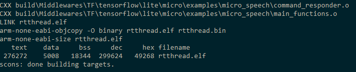
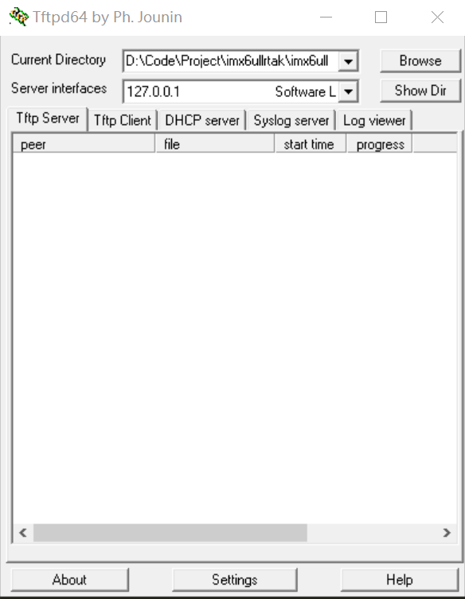
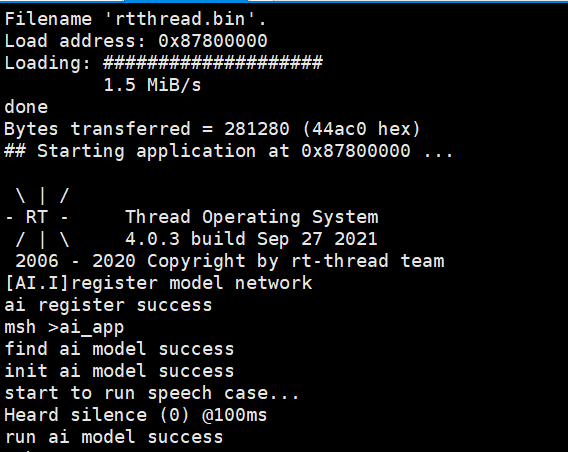

<center><h1>RT-AK imx6ull 快速上手</h1></center>

[TOC]

*本项目为 `RT-AK` 的一个实战 `DEMO`。*

*本教程 RT-AK 搭配平台插件：imx6ull*

- Windows 10
- Python >= 3.7

# 1. 准备工作

准备以下三份材料：

| Index |     Prepare     | Example                                                      |
| :---: | :-------------: | ------------------------------------------------------------ |
|   1   | 硬件以及 `BSP`  | `imx6ull(正点阿尔法) BSP`                                                 |
|   2   |  神经网络模型   | `./rt_ai_tools/Model/facelandmark.tflite`                         |                     |
|   3   |     `RT-AK`     | [RT-AK](https://github.com/RT-Thread/RT-AK.git) 代码克隆到本地 |

- 下载 `imx6ull BSP` 地址： [imx6ull](http://117.143.63.254:9012/www/RT-AK/sdk-bsp-artpi.zip)

# 2. 执行步骤

> 代码将会自动使用 `tensorflow lite micro` 推理后端，获得一个集成了 AI 的 BSP
>
> 对，就是这么硬核，一步肝到位！

内部的流程请看源码或者 `plugin_imx6ull` 仓库下的 `readme` 文档

# 3. 运行命令

请在 `edge-ai/RTAK/tools` 路径下运行该程序。


```shell
# 基础运行命令
python aitools.py --project <bsp> --model_name <model_name> --platform imx6ull

# 示例
python aitools.py --project="D:\Code\Project\imx6ullrtak\imx6ull" --model="./Models/facelandmark.tflite" --platform=imx6ull --clear
```


# 4.编译

支持的编译器

- `Env Scons`

- [Env 工具](https://www.rt-thread.org/document/site/#)

进入到 `BSP` 项目工程路径，右键打开 Env

执行：

```shell
# 这是个好习惯
$ scons -c
$ scons -j 6
```




# 5. 下载

根据前面的步骤，已经成功获得了一个集成了 `AI` 和 `RT-Thread` 的新的 `ART-Pi BSP`，

就可以`RT-Thread` 系统上做应用开发：

```c
#include <rt_ai.h>
#include <rt_ai_log.h>
#include <rt_ai_network_model.h>

int ai_app(void)
{
    rt_err_t result = RT_EOK;
    model = rt_ai_find(RT_AI_NETWORK_MODEL_NAME);
    if(model == RT_AI_NULL){
        return -1;
    }
    rt_kprintf("find ai model success\n");
    //初始化模型
    result = rt_ai_init(model , NULL);
    if(result != 0){
        return -1;
    }
    rt_kprintf("init ai model success\n");
    result = rt_ai_run(model , NULL, NULL);
    if (result != 0) {
        rt_kprintf("ai model run err\r\n");
        return -1;
    }
    rt_kprintf("run ai model success\n");
}
MSH_CMD_EXPORT(ai_app , "test ai function");
```

应用开发 `API` 见 [rt_ai_lib/readme](../rt_ai_lib)

完整的示例工程：https://github.com/EdgeAIWithRTT/Project3-Mnist_Cube_RTT/tree/master/Mnist_RTT


1. 打开Tftpd64软件设置tftp烧录路径



2. 在uboot中设置tftp烧录

```c
setenv bootcmd "dhcp 0x87800000 192.168.1.101:rtthread.bin;dcache flush;go 0x87800000"
```

3. 重启开发板




